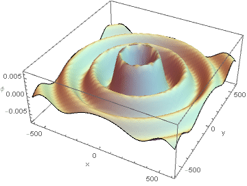

# Plotting electromagnetic waves using Mathematica
Considering the point charge $q(t)$ at the origin of coordinate, its retarded potential $\phi(\bm{x},t)$ is given by
$$
\phi(\bm{x},t)=\dfrac{q(t-|\bm{x}|/c)}{4\pi\epsilon_0|\bm{x}|}.
$$

I made a dynamic plot of this potential using mathematica in the form of retarded potentials.

